# Arquitectura WS2812/LiteX

Fecha local: 2026-07-10
Base inspeccionada: `Litex/ws2812/`, `Litex/colorlight_i5*.py`, `Litex/Makefile`

## Actualizacion 2026-07-11 - Arquitectura Colorlight 5A-75B

Se agrego una variante fisica especifica para Colorlight 5A-75B:

```text
Litex/colorlight_5a_75b_ws2812_dma.py
```

Esta variante preserva el periferico WS2812 validado y cambia solamente la plataforma/constraints hacia `litex_boards.platforms.colorlight_5a_75b`. La arquitectura de producto es:

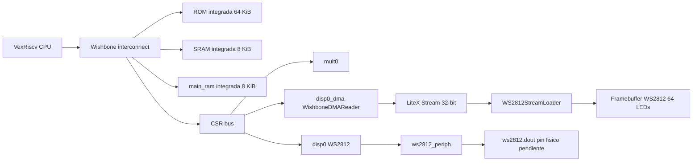

El pin `j1:0` usado en el build 2026-07-11 es temporal para PnR. El diagrama final no debe fijar un pin de salida hasta confirmar el cableado DIN real de la matriz WS2812.

## Actualizacion de cierre

La arquitectura cerrada en esta ronda es de 64 LEDs. `ws2812_periph.v` usa `N_LEDS=64`, `ctrl_ws_arr.v` espera la lectura del framebuffer antes de iniciar cada LED y `led_mem_dual.v` entrega el puerto de lectura en flanco positivo. Con esto se evitan accesos a direccion 64. El build local i5 genera bitstream, pero la corrida fresca queda en `57.02 MHz (FAIL at 60.00 MHz)`, asi que el cierre temporal sigue pendiente.

La integracion fisica final para Colorlight 5A-75B sigue pendiente. El diagrama conserva `led_matrix.dout pin G5` porque ese dato proviene de la plataforma local `colorlight_i5`; no debe trasladarse a 5A-75B sin confirmar revision y pinout.

## Arquitectura general del SoC

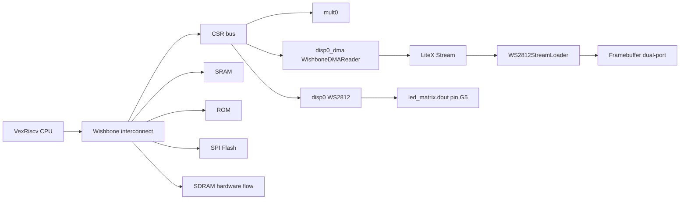

En simulacion no-BIOS DMA, `SIMULATION=1` evita agregar SDRAM y el firmware corre desde ROM integrada.

## Caja negra del periférico

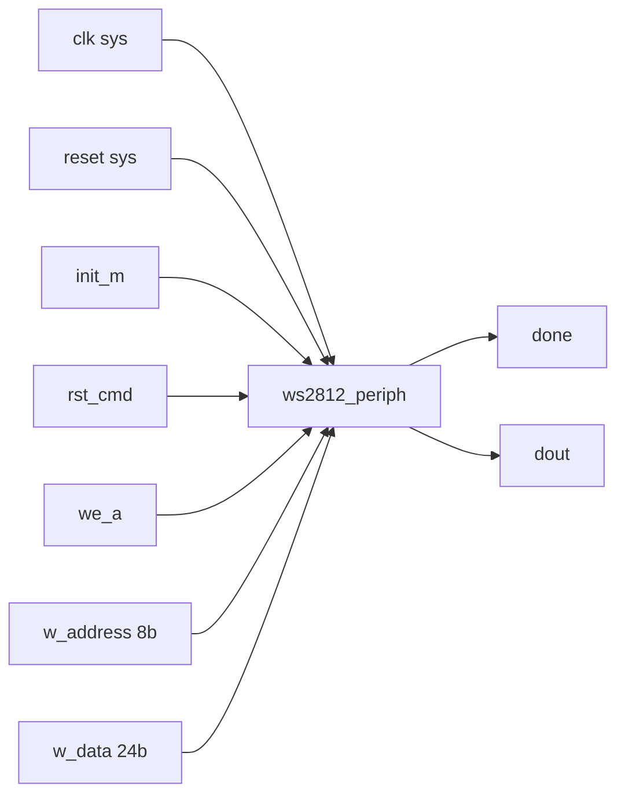

## Jerarquía de módulos

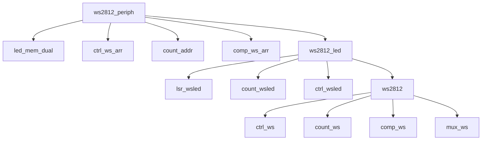

## Arquitectura interna del periférico

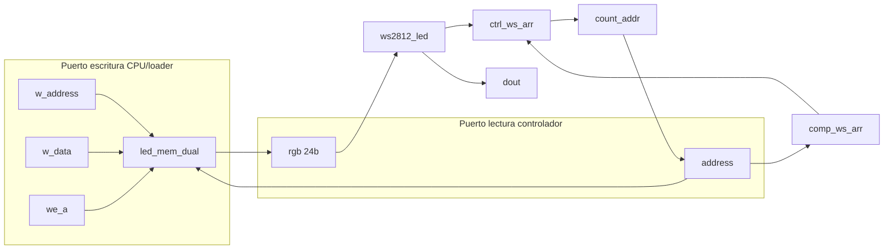

## Separación control/camino de datos

### Camino de datos

| Bloque | Archivo | Funcion |
| --- | --- | --- |
| Registro de desplazamiento | `lsr_wsled.v` | Carga RGB/GRB y desplaza MSB-first |
| Contador de bits | `count_wsled.v` | Cuenta 24 bits por LED |
| Contador temporal | `count_ws.v` | Cuenta ciclos del bit/reset |
| Comparador temporal | `comp_ws.v` | Detecta fin de T0H/T1H/PER/RES |
| Mux de tiempos | `mux_ws.v` | Selecciona T0H, T1H, PER o RES |
| Contador direccion | `count_addr.v` | Recorre framebuffer |
| Comparador direccion | `comp_ws_arr.v` | Detecta fin de matriz |
| Framebuffer | `led_mem_dual.v` | Memoria `2**SIZE x 24` |
| Salida | `dout` | Señal serial WS2812 |

### Unidad de control

| FSM | Archivo | Estados |
| --- | --- | --- |
| Temporizador/bit | `ctrl_ws.v` | `START`, `CHK_SEL`, `SEND_RES`, `SEND_0`, `SEND_1`, `WAIT_TRST`, `WAIT_TH`, `SEND_PER`, `WAIT_T`, `END_SEND` |
| LED | `ctrl_wsled.v` | `START`, `CHK_SEL`, `SEND_BIT`, `WAIT_TX`, `SHIFT`, `CHECK_END`, `END_SEND` |
| Matriz | `ctrl_ws_arr.v` | `START`, `START_SEND`, `SEND_LED`, `WAIT_TX`, `INC`, `CHECK_END`, `END_SEND` |

## FSM temporizador

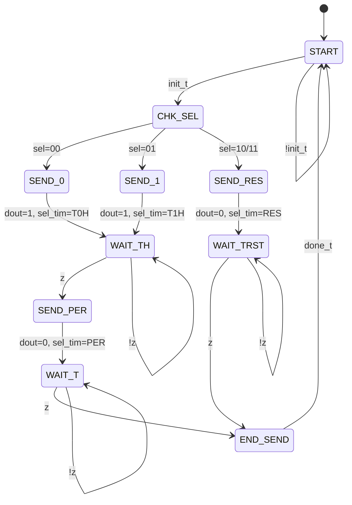

## FSM transmisor de un LED

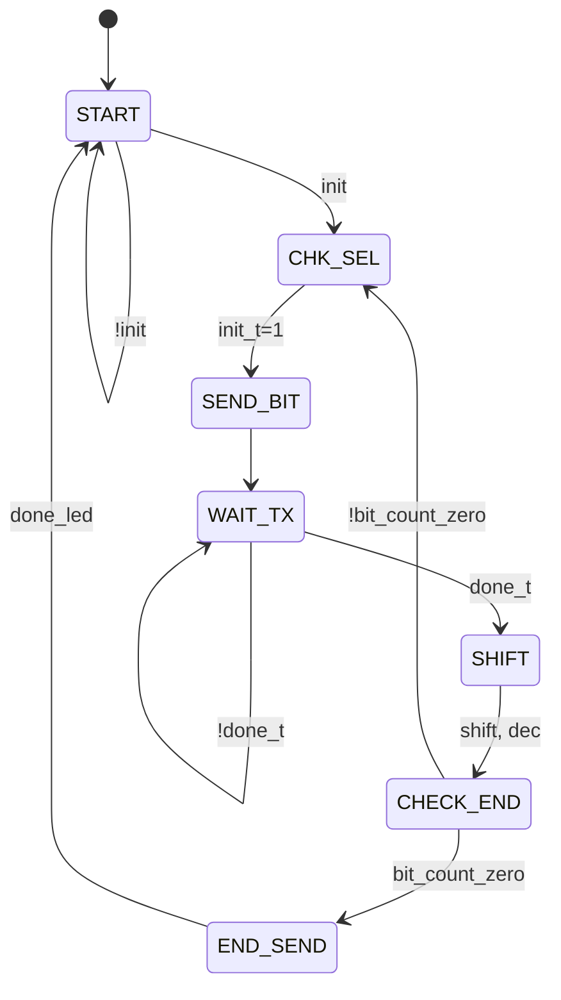

## FSM controlador de N LEDs

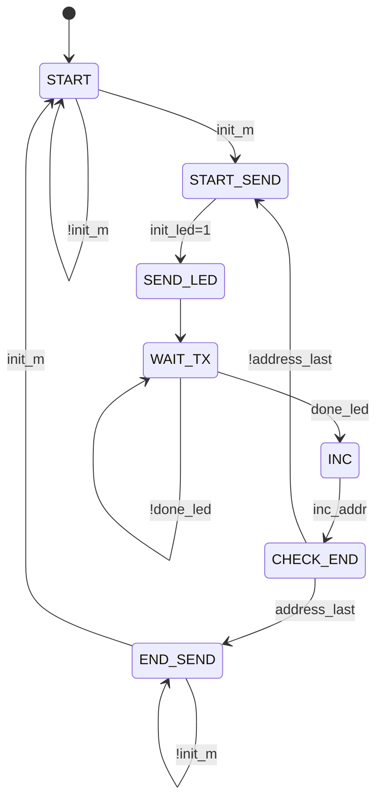

## Secuencia CPU-CSR-WS2812-matriz

### Camino DMA principal

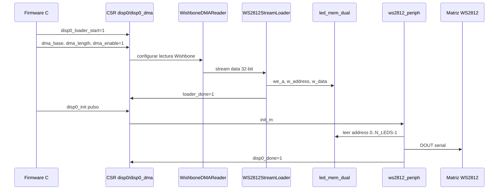

## Diagrama de flujo del algoritmo

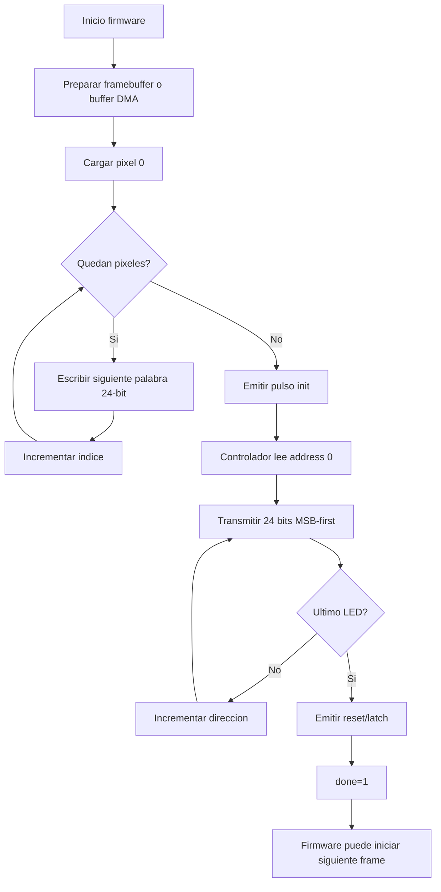

## Mapa de memoria

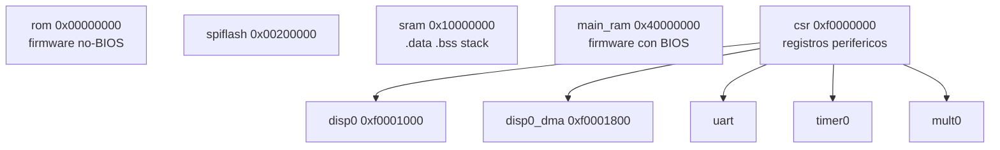

## Mapa CSR

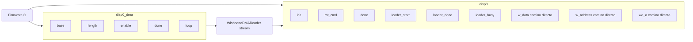

## Flujo no-BIOS de simulación

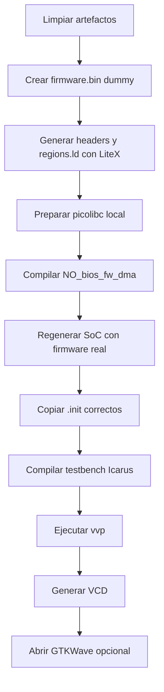

## Flujo con BIOS

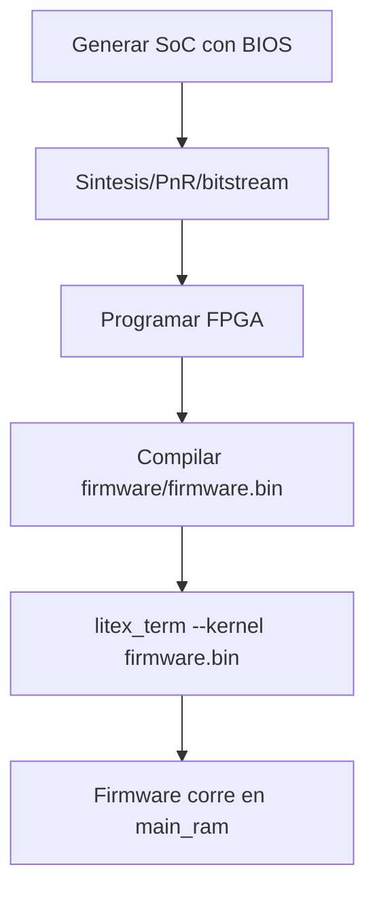

## Flujo de pruebas

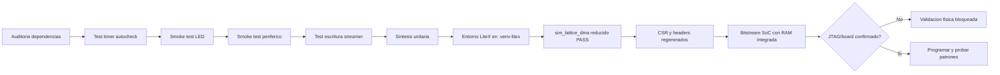

## Observaciones tecnicas

- La jerarquia academica requerida ya existe.
- El camino DMA/Stream es una extension reciente y parece ser el flujo principal actual.
- El camino CSR directo existe y satisface el alcance base framebuffer + CSR, pero no es el camino de simulacion DMA reciente.
- La temporizacion WS2812 fue recalculada para `sys_clk_freq=60 MHz`: bit 0 alto 24 ciclos, bit 1 alto 48 ciclos, periodo de bit 75 ciclos y reset minimo 3000 ciclos.
- El riesgo de cierre principal ya no es funcional sino fisico/temporal: el build con SDRAM externa excede BRAM y el build con RAM integrada genera bitstream, pero reporta `57.14 MHz` maximos frente a los `60.00 MHz` requeridos.
- El testbench `ws2812_timer_check_TB.v` ya es autochecking para la temporizacion basica. El test SoC DMA reducido confirma carga DMA de 256 palabras y transmision WS2812 reducida mediante `SIM_N_LEDS=4`; la transmision completa de 256 LEDs queda lenta para simulacion RTL completa.
